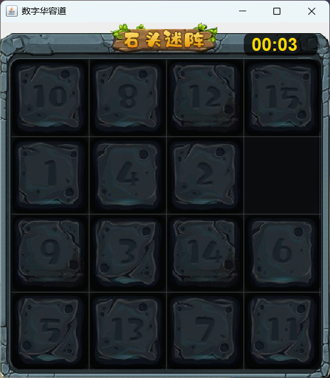
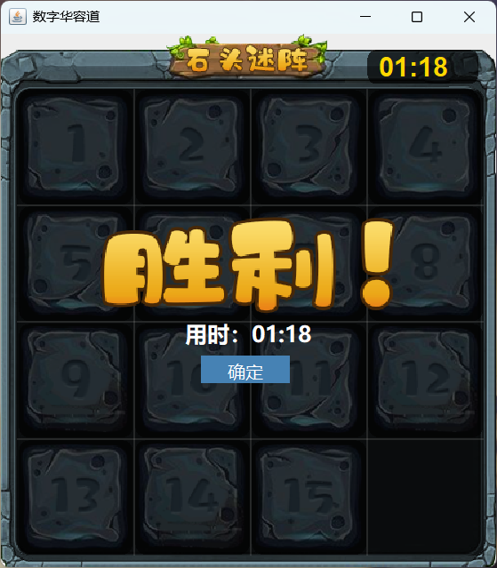

# 数字华容道 - Stone Maze Game 🎮

这是一个用 Java Swing 编写的经典数字拼图游戏，支持暂停、计时、胜利提示和返回主菜单功能。

## 📸 游戏截图

## 🧩 功能特性

- 游戏开始界面
- 拖动数字方块
- 计时器显示
- 胜利动画 + 显示用时 + 确定按钮
- 暂停、重新开始、返回主菜单

## 🛠 技术栈

- Java SE
- Swing GUI
- JDK 8+
- Maven or Gradle (可选)

## 📦 运行方式

1. 克隆仓库：git clone https://github.com/Bai-mu-ha/Game-Huarong-Road
3. 导入到 IntelliJ IDEA / Eclipse / VSCode + Java 插件
4. 运行 [App.java](Stone-maze\src\App.java)

## 📝 作者

👤 Bai-mu-ha

## 📎 License

MIT
